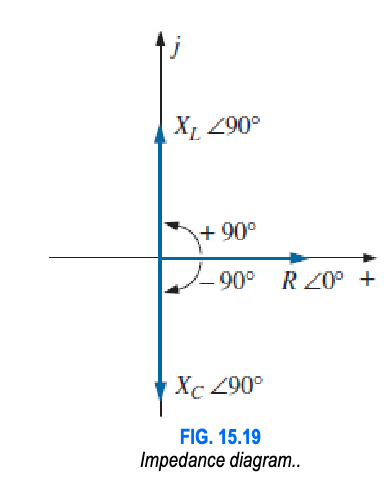

## Capacitive Circuits

Capacitive Reactance , $X_C$
- Unit: $\Omega$
- Formula: $X_C = \dfrac{1}{\omega C} = \dfrac{1}{2\pi fC}$

Phase differences between $V$ & $I$ wrt $V$:
- $0^\circ \implies$ Resistors
- $-90^\circ \implies$ Inductor
- $+90^\circ \implies$ Capacitor

Impedance

Phasor representation:

Time domain representation:

## Average Power

> In UDST, $P \implies P_{avg}$

For a resistive circuit,
- $P=VI=\dfrac{V^2}{R}=I^2R$

For a single phase (inductor or capacitor):
- $P = VI\cos\theta = \dfrac{V_mI_m}{\sqrt{2}} \cos\theta$
- $\theta = |\theta_v-\theta_i |$
Where $\theta$ is the absolute phase difference b/w $i$ and $v$.

For an Inductor and Capacitor:
$\cos 90^\circ = 0 \implies P = 0~\mathrm{W}$

## Power factor

- Whether $F_p$ is lagging or leading is determined by the angle of current.
    - Lagging $F_p \implies$ inductive circuit
    - Leading $F_p \implies$ capacitive circuit
    - Unity $F_p$ or $F_p=1$ $\implies$ resistive circuit
- Unit: Unitless
- Power factor, $F_p = \cos\theta,~\text{where}~\theta=|\theta_v-\theta_i |$

## RLC Circuits

### Polar representation

- In math, we have $i = \sqrt{-1}$
- In engineering, we have $j = \sqrt{-1}$

| Polar Form | Rectangular form |
|---|---|
| $\vec{C}=Z \angle \theta$ | $\vec{C}=R+jX$ |
| $Z=$ Impedance | $R=$ Resistance, $X=$ Reactance |

- Here, $X$ is any type of reactance or the difference of the inductive and capacitive reactance.
- $\vec{C}$ is a vector. $Z \angle \theta$ and $R+jX$ are its expansions. For now, we shall ignore $\vec{C}$.

---
> Math

For $x \angle \theta_1$ and $y \angle \theta_2$:
- For calculation by hand, we convert them to rectangular form
- For calculation by calculator, we directly do calculations in complex mode
---
